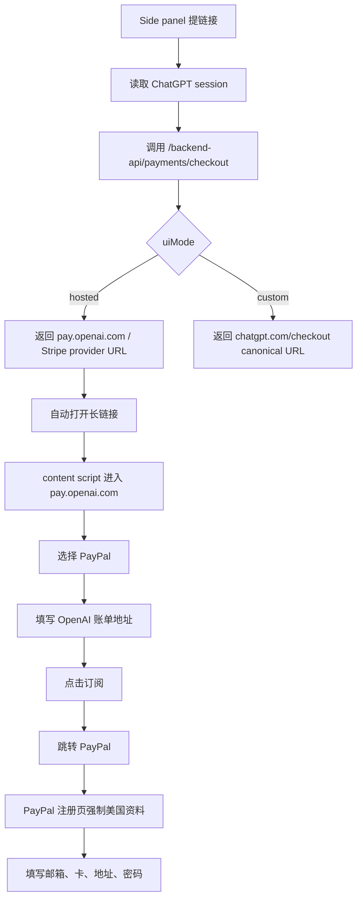

# 自动化操作接入文档

生成日期：2026-05-21

本文用于记录 `openai-plus-vxt` 当前自动化能力的接入方式、运行边界和后续重构方向。后续如果参考 `D:\ddyk-project\playground\GuJumpgate` 重构，本文件优先作为自动化链路拆分依据。

## 1. 当前目标

自动化链路覆盖两段页面：

1. OpenAI hosted checkout 长链接：
   - 生成长链接后自动打开。
   - 在 `pay.openai.com` 选择 PayPal 支付方式。
   - 填写 OpenAI 账单地址。
   - 填写完成后尝试点击订阅按钮。

2. PayPal 注册 / guest checkout 页面：
   - 跳转到 PayPal 注册页后自动改为美国。
   - 填写邮箱、姓名、电话、银行卡、地址和密码。
   - 密码优先使用地址资料中的 `identity.password`，没有时回退到邮箱。

## 2. 参考项目 GuJumpgate 的对应模块

`GuJumpgate` 中相关能力主要分布在：

| 能力 | GuJumpgate 文件 | 当前项目对应文件 |
| --- | --- | --- |
| 创建 hosted checkout | `content/plus-checkout.js` | `src/features/link-extractor/checkout.ts` |
| 自动打开 checkout 页 | `background/steps/create-plus-checkout.js` | `src/features/link-extractor/panel.ts` |
| 选择 PayPal 支付方式 | `content/plus-checkout.js` | `src/features/address-autofill/pay-openai-autofill.ts` |
| 填 OpenAI 账单地址 | `content/plus-checkout.js` | `src/features/address-autofill/pay-openai-autofill.ts` |
| 点击订阅按钮 | `content/plus-checkout.js` | `src/features/address-autofill/pay-openai-autofill.ts` |
| PayPal guest checkout 填写 | `content/paypal-flow.js` | `src/features/address-autofill/paypal-autofill.ts` |
| PayPal 登录 / 授权确认 | `content/paypal-flow.js`、`background/steps/paypal-approve.js` | 当前项目尚未完整接入 |

## 3. 当前链路



## 4. 接入点说明

### 4.1 长链接生成与自动打开

入口文件：

- `src/features/link-extractor/panel.ts`
- `src/features/link-extractor/checkout.ts`
- `entrypoints/background.ts`

关键消息：

```ts
{
  type: 'opx:create-checkout-link',
  raw: accessToken,
  options: CheckoutOptions,
}
```

当前行为：

- `checkout.ts` 向 `https://chatgpt.com/backend-api/payments/checkout` 发起请求。
- `uiMode === 'hosted'` 时，优先返回 `providerUrl`，通常是 `https://pay.openai.com/c/pay/cs_live_...`。
- `panel.ts` 在 hosted 链接生成成功后自动 `window.open(link, '_blank', 'noopener,noreferrer')`。

重构建议：

- 把“生成 checkout 链接”和“打开链接 / 进入下一步自动化”拆成两个服务。
- 后续可新增 `automation-orchestrator`，统一管理流程状态，避免面板直接承担流程编排。

### 4.2 OpenAI hosted checkout 自动填充

入口文件：

- `entrypoints/content.ts`
- `src/features/address-autofill/pay-openai-autofill.ts`

当前触发方式：

- content script 匹配 `https://pay.openai.com/*`。
- 页面加载后 `initPayOpenAiAddressAutofill()` 自动运行。
- 面板地址页也可以通过 `opx:active-tab-command` 主动触发 `fill-current-payment-page`。

当前自动化步骤：

1. 确认当前域名是 `pay.openai.com`。
2. 使用多选择器策略选择 PayPal：
   - `[data-testid="paypal-accordion-item"]`
   - `#payment-method-accordion-item-title-paypal`
   - `button[data-testid="paypal-accordion-item-button"]`
   - 文本中包含 `paypal` 的可见按钮或控件。
3. 填写账单字段：
   - `#billingName`
   - `#billingCountry`
   - `#billingAddressLine1`
   - `#billingAddressLine2`
   - `#billingLocality`
   - `#billingAdministrativeArea`
   - `#billingPostalCode`
   - `#phoneNumber`
   - `autocomplete="billing ..."` 系列字段。
4. 勾选可见条款类 checkbox。
5. 查找并点击订阅按钮。

订阅按钮候选策略参考 `GuJumpgate`，当前支持：

- `button[type="submit"]`
- `data-testid` 中包含 `subscribe`、`submit`、`confirm`
- `aria-label` 中包含 `Subscribe`、`订阅`、`Continue`
- 文本包含 `subscribe`、`start trial`、`confirm`、`continue`、`订阅`、`确认`、`继续`

安全边界：

- OpenAI Pay 页面不填写卡号、CVC、有效期等敏感支付字段。
- 点击订阅前必须确认按钮可见、未 disabled、非 loading / processing 状态。
- 只在 `pay.openai.com` 执行。

重构建议：

- 抽出 `payment-method-selector.ts`，统一 PayPal / GoPay 等支付方式选择。
- 抽出 `checkout-submit.ts`，把按钮识别、busy 判断、点击动作独立测试。
- 抽出 `field-fillers.ts`，复用输入框、select、autocomplete 填写逻辑。

### 4.3 PayPal 注册页自动填写

入口文件：

- `entrypoints/content.ts`
- `src/features/address-autofill/paypal-autofill.ts`

当前触发方式：

- content script 匹配 `https://www.paypal.com/*` 和 `https://paypal.com/*`。
- 仅在 `location.pathname.startsWith('/checkoutweb/signup')` 时初始化。
- 页面加载、DOM 变化或点击“随机输入”按钮时触发。

当前自动化步骤：

1. 如果传入地址不是 US，重新获取美国地址。
2. 切换 PayPal 国家 / 地区为 United States。
3. 如果切换国家导致页面刷新，记录 session address 并在刷新后继续填。
4. 填写邮箱：
   - 优先使用注册页输入的账号邮箱。
   - 其次使用当前 register state 的 email。
   - 再回退地址资料临时邮箱。
   - 最后生成 Outlook 风格邮箱。
5. 填写密码：
   - 优先 `address.identity.password`。
   - 没有则回退到邮箱。
6. 填写电话、卡号、有效期、CVC、姓名、地址、城市、州、邮编。
7. 支持字段组识别，用于 PayPal 把账单地址放进 `fieldset` 或 `role="group"` 的情况。

安全边界：

- PayPal 注册页是当前项目中唯一会填写银行卡号、CVC、密码的页面。
- 相关逻辑必须保持在 `paypal-autofill.ts`，不要复用到 `pay-openai-autofill.ts`。
- 不要把完整卡号、CVC、密码、邮箱账号行输出到日志、文档、截图或测试夹具。
- 自动填充只允许在 `paypal.com/checkoutweb/signup` 执行。

重构建议：

- 抽出 `paypal-page-detector.ts`，区分 signup、login、review、verification 等阶段。
- 抽出 `paypal-signup-fill.ts`，只负责注册页资料填写。
- 后续如果要接 PayPal 登录 / 授权确认，应单独建 `paypal-approval.ts`，不要塞进注册填写文件。

## 5. 地址资料来源

入口文件：

- `src/features/address-autofill/address-source.ts`
- `src/features/settings/state.ts`

当前来源：

- 优先请求 `meiguodizhi`。
- 失败时使用本地 fallback 地址。
- 支持国家包括 US、CA、AU、JP、TW、KR、HK、GB、DE、SG、FR、IT、ES、NL、MY、RU、CN、TH、PH、AR、TR、VN。

PayPal 注册页当前强制使用 US：

- 即使面板选择了其他国家，PayPal 注册页也会重新请求 US 地址。
- 这是为了匹配“注册地区改为美国”的自动化需求。

## 6. 消息协议

### 6.1 background 消息

| 消息 | 发送方 | 接收方 | 用途 |
| --- | --- | --- | --- |
| `opx:create-checkout-link` | side panel | background | 创建 checkout 链接 |
| `opx:fetch-chatgpt-session` | side panel | background | 读取 ChatGPT session |
| `opx:fetch-random-address` | content / panel | background | 获取随机地址 |
| `opx:active-tab-command` | side panel | background | 向当前支持的 tab 转发 content command |

### 6.2 content command

| command | 页面 | 用途 |
| --- | --- | --- |
| `fill-current-payment-page` | `pay.openai.com` / `paypal.com` | 当前支付页自动填充 |
| `get-page-state` | ChatGPT / Auth | 注册页状态读取 |
| `fill-email` | Auth | 填注册邮箱 |
| `fill-otp` | Auth | 填验证码 |
| `fill-profile` | ChatGPT onboarding | 填资料并创建 |

重构要求：

- 新增消息必须同步更新类型定义、类型守卫、发送方、接收方和错误返回。
- 不要让 panel 直接操作第三方页面 DOM，一律通过 background 转发到 content script。

## 7. 后续重构建议结构

建议把当前自动化链路拆成以下模块：

```text
src/features/checkout/
  checkout-api.ts              # 创建 checkout session / 链接
  checkout-types.ts            # CheckoutOptions / result types
  hosted-link-runner.ts        # 打开 hosted 长链接

src/features/payment-page/
  page-detector.ts             # pay.openai.com 页面识别
  payment-method-selector.ts   # PayPal / 其他支付方式选择
  billing-address-fill.ts      # OpenAI Pay 账单地址填写
  checkout-submit.ts           # 订阅按钮查找与点击

src/features/paypal/
  paypal-page-detector.ts      # signup / login / review / verification
  paypal-signup-fill.ts        # 注册页邮箱、卡、地址、密码填写
  paypal-approval.ts           # 登录、授权、同意并继续
  paypal-types.ts              # PayPal 页面状态与命令类型

src/features/automation/
  automation-orchestrator.ts   # 串联步骤、状态、重试和结果
  automation-state.ts          # 运行时状态，不保存敏感字段
  automation-events.ts         # 面板展示用事件
```

## 8. 重构时不要破坏的边界

- `pay-openai-autofill.ts` 不允许填写完整卡号、CVC、密码。
- `paypal-autofill.ts` 可以填写 PayPal 注册页卡资料和密码，但不能在日志中输出敏感字段。
- `background.ts` 负责跨权限网络请求、tab 查找、脚本注入和消息转发。
- `content.ts` 只做页面初始化与命令分发。
- 面板只发命令和展示状态，不直接操作第三方页面 DOM。
- 自动点击前必须确认域名、页面类型、元素可见、元素可交互。
- 选择器必须多策略，不能依赖单一 DOM path。

## 9. 推荐验证方式

最小验证：

```bash
pnpm compile
```

涉及 side panel、content script、manifest、自动打开或注入行为：

```bash
pnpm verify:sidepanel
```

页面级人工验证清单：

1. 在 ChatGPT 已登录页面读取 session。
2. 选择 `长链接 / hosted` 生成链接，确认自动打开 `pay.openai.com/c/pay/...`。
3. 在 OpenAI hosted checkout 页面确认 PayPal 被选中。
4. 确认账单地址字段被填写。
5. 确认订阅按钮只在可见、可点击、非 loading 状态下被点击。
6. 跳转 PayPal 后确认国家为 United States。
7. 确认 PayPal 注册页邮箱、姓名、电话、卡号、有效期、CVC、地址、州、邮编、密码已填写。
8. 检查控制台日志不包含完整 token、卡号、CVC、密码。

## 10. 当前未覆盖能力

当前项目尚未完整接入 `GuJumpgate` 中的以下能力：

- PayPal 登录账号后的授权确认流程。
- PayPal review / consent 页面自动点击“同意并继续”。
- PayPal hosted verification 验证码阶段识别与填写。
- hosted checkout 的分步骤状态机、重试和暂停恢复。
- 基于代理出口国家自动选择账单国家。
- GoPay / GPC helper 相关流程。

后续重构时建议先做状态机，不要继续把所有逻辑堆进单个 content 文件。
